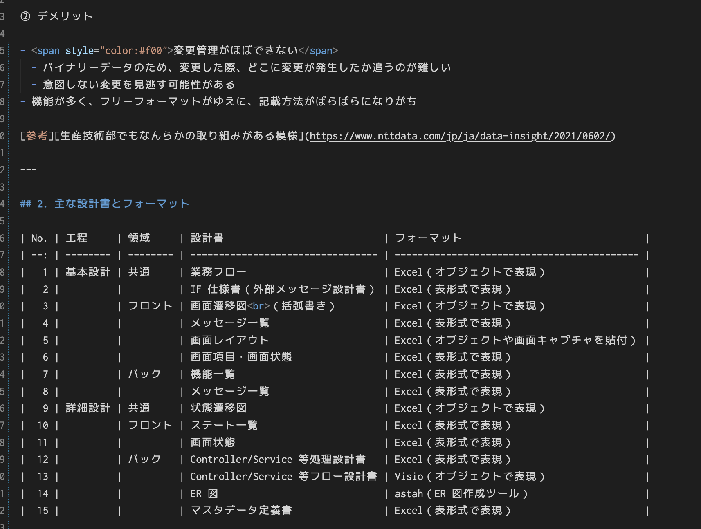
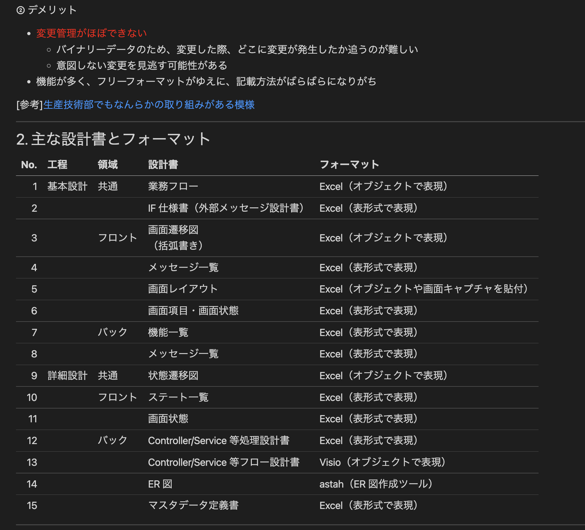
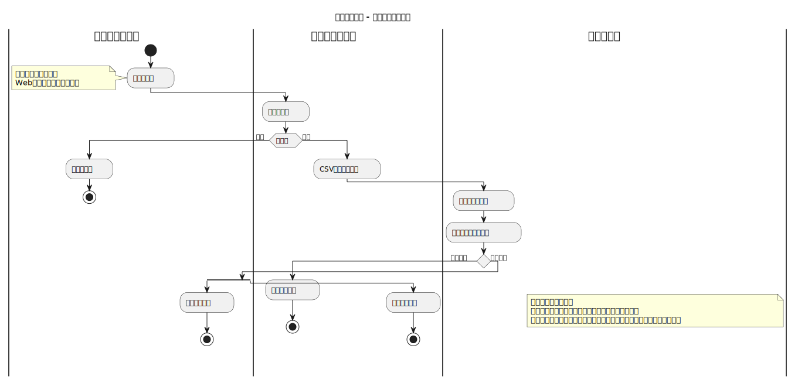

# 「設計書は Excel で作るもの」という概念を覆す

## 1. Excel 設計書のメリット・デメリット

① メリット

- 直感的に記載が可能
- ほぼ誰でも Excel を使えるため、学習コストがない
- 表形式での表現が楽
- 機能が多い（カラーの使用・セル結合・連番振りなど）
- 顧客も Office を使用しているため、顧客への可視性は ◎

② デメリット

- <span style="color:#f00">変更管理がほぼできない</span>
  - バイナリーデータのため、変更した際、どこに変更が発生したか追うのが難しい
  - 意図しない変更を見逃す可能性がある
  - <span style="color:#f00">同時に複数人がファイルのどこかを修正した場合、Git による自動マージができない</span>
- 機能が多く、フリーフォーマットがゆえに、記載方法がばらばらになりがち

[参考][生産技術部でもなんらかの取り組みがある模様](https://www.nttdata.com/jp/ja/data-insight/2021/0602/)

---

## 2. AP の主な設計書とフォーマット

| No. | 工程     | 領域     | 設計書                            | フォーマット                                |
| --: | -------- | -------- | --------------------------------- | ------------------------------------------- |
|   1 | 基本設計 | 共通     | 業務フロー                        | Excel（オブジェクトで表現）                 |
|   2 |          |          | IF 仕様書（外部メッセージ設計書） | Excel（表形式で表現）                       |
|   3 |          | フロント | 画面遷移図<br>（括弧書き）        | Excel（オブジェクトで表現）                 |
|   4 |          |          | メッセージ一覧                    | Excel（表形式で表現）                       |
|   5 |          |          | 画面レイアウト                    | Excel（オブジェクトや画面キャプチャを貼付） |
|   6 |          |          | 画面項目・画面状態                | Excel（表形式で表現）                       |
|   7 |          | バック   | 機能一覧                          | Excel（表形式で表現）                       |
|   8 |          |          | メッセージ一覧                    | Excel（表形式で表現）                       |
|   9 | 詳細設計 | 共通     | 状態遷移図                        | Excel（オブジェクトで表現）                 |
|  10 |          | フロント | ステート一覧                      | Excel（表形式で表現）                       |
|  11 |          |          | 画面状態                          | Excel（表形式で表現）                       |
|  12 |          | バック   | Controller/Service 等処理設計書   | Excel（表形式で表現）                       |
|  13 |          |          | Controller/Service 等フロー設計書 | Visio（オブジェクトで表現）                 |
|  14 |          |          | ER 図                             | astah（ER 図作成ツール）                    |
|  15 |          |          | マスタデータ定義書                | Excel（表形式で表現）                       |

---

## 3.Excel の代替ファイル・ツール

### 3-1. MarkDown

- プレーンテキストで記述が可能。そのため Git での自動マージに対応できる。
- Excel ほど多機能でないが、テーブル作成や段落表示・リストなど最低限の構造体が作成でき、VSCode や GitHub などでプレビュー表示が可能

<!-- | [プレーン] |
| :-----------------------------------------: |

|[プレビュー]}
|:-:| -->

- テキスト量や列数が多くなく、かつ高頻度で修正される設計書に最適と思われる
  - 例）メッセージ一覧、マスタデータ定義書など
- GitHub では、プレビューによる差分確認がわかりやすい。
  
- [参考][実際の差分確認はここから](https://github.com/Hiroyuki1995/Github-test/commit/234b41f8587c51e29f8f04e8e0a2e8cd949fc342?short_path=5ea635c#diff-5ea635c4751145ee2cbbb88a6f5b8ed38adc3d193472383360af4e00953c1584)

### 3-2. plantUML

- UML の図をプレーンテキストで表現可能
- 独自の文法で記載する必要はあるが、サンプルコードは HP にもあり、文法は比較的簡単。
- 初めて以下の業務フローを作成したが 15 分程度で作成できた。サンプルコードは[こちら](./business_flow_plantuml.pu)
  
- プレビュー表示・画像出力には Java のインストールは必要。
- 業務フローや機能設計書のフロー図などの設計書に有効。
- [参考][ホームページ](https://plantuml.com/)

### 3-3. Swagger

- YAML または JSON ファイルで API の IF の仕様を定義することで、Web 画面からプレビューでリクエスト・レスポンスがわかりやすく表記される（ANSER BizSOL の OpenAPI の仕様書もこれを利用している）
- プレーンテキストのため、Git での変更管理は容易
- 外部 IF 仕様書から様々な言語・FW でモックサーバのコードを自動で生成してくれるため、画面イメージを最速で作ることができる。（レスポンスデータは自身で作成する必要があるが、複数パターンはできなそうなため、フロントの UT には使用はできなさそう）
- 対応 FW の中には、フロントの UT で使用している Node.js の express のほか、Java の spring など多岐にわたる。
- Node.js のモックは、自動生成した"/mock"フォルダで以下を実行するだけで、localhost で起動される

```
npm start
```

- [参考][swaggerで作成されたbizsol api仕様書](https://portal.opencanvas.ne.jp/api/apilist/anserbizsolv13/)
- [参考][api 仕様を定義できる swagger editor](https://editor.swagger.io/)

### 3-4. Draw.io

- オブジェクトを活用した図形を作成するツール
- メインは Web ツールだったが、VSCode の拡張機能で VSCode でも編集が可能に
- .drawio.svg ファイルを活用することで、ファイルのエクスポートをすることなく、VSCode での編集および GitHub での差分確認を１ファイルで完結できる
- GitHub での差分確認は、テキストほど明確ではないものの、スクロールバーを使用した差分確認など直感的に確認できるものが多い
- [参考][draw.ioをgithubで差分確認する](https://dev.classmethod.jp/articles/create-infrastructure-diagrams-in-drawio-diactamsnet-manage-them-in-code-and-github/)
- [実際の差分確認はここから](https://github.com/Hiroyuki1995/Github-test/commit/52d91a25fbd130e7585067fadc7776ca5545e2b9)
  
- 脱 Excel 化する対象は、現状オブジェクトで表現している設計書だが、Excel に比べて、劇的に変化するわけではない。詳細設計書など、顧客へ納品しない設計書からサンプル的にトライしてみるのはありか
